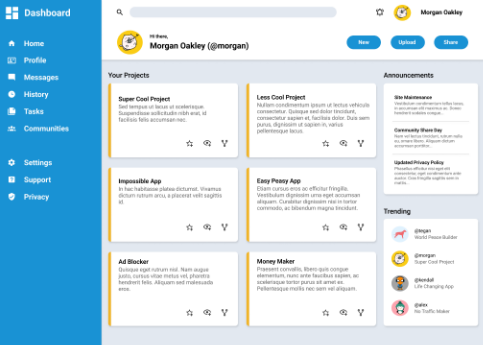
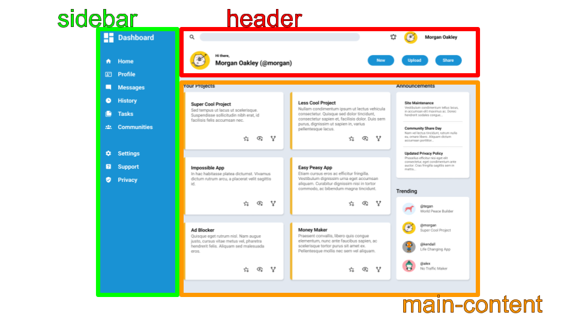
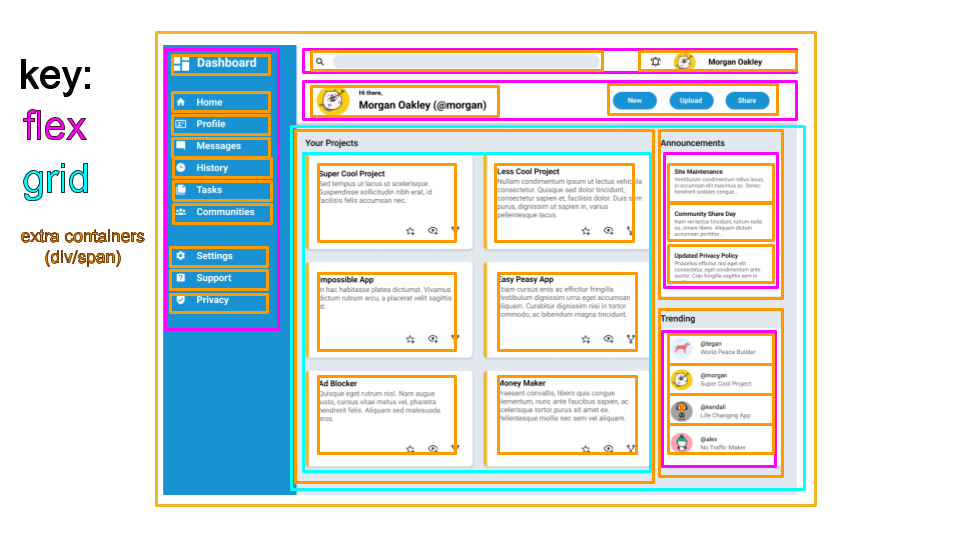
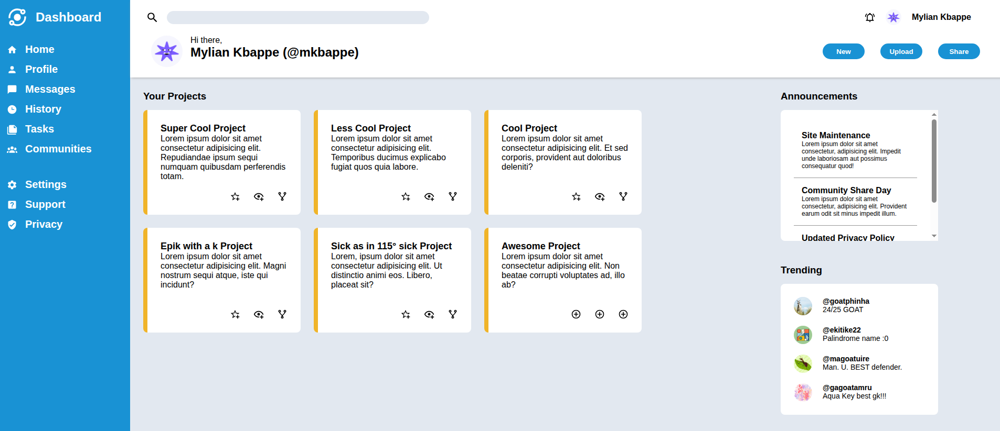

# admin-dashboard
For this project, I needed to emulate the following admin dashboard (from the Odin Project):

  

* I just needed to be able to create a similar layout, and it did not need to be interactive nor responsive. 

* I had just learned of grid displays, forms, and other intermediate html/css concepts. This was meant to be used as a test of what I had learned so far.

* **This README file will be used as an explanation of my thought process and the steps I took to achieve a similar admin dashboard.**

<h2>Step 1: Plan</h2>
1. The first thing I did was find the 3 major parts of the layout. This was easy as the Odin Project literally told me lolll.

  

2. Next, I wanted to divvy up the parts of the layout more by finding out which parts were going to be flex, grid, or just a simple container (div/span). The following image was a reference I made and later used, however, not as much as I thought. Also, changes were made on the fly that weren't reflected on this reference image I'm sure. 

  

*(Now that I think about it, this reference's lack of usage later on was probably because of how dookie the reference was lolll. 1: the color choice was bad. 2: kinda hard to tell what was going on if you weren't me 10 minutes after i made it lolll)*

<h2>Step 2: Write out html</h2>

1. tab ! for basic boilerplate (so goated)
2. Add all sections (I tried using section and header instead of div for semantics sake)
3. Add content
4. Add containers (divs/spans) for better styling later

<h2>Step 3: Style</h2>

Oooh boy.

* I took this section by section, starting with the sidebar, then header, then finally main-content.
* While I was working on the sections, I had a temporary image that I used for literally all the icons and profile pictures. I thought it would be useful for formatting. My logic was that if I added formatting with images in mind early, I wouldn't need to do it later and potentially mess up ALL the formatting. I do believe the plan worked :)

  

  *(Above is the temp-image.svg I used and later replaced with the appropriate images)*

* Styling was by far the longest step. Planning was a few minutes. HTML was maybe at most 2 hours. CSS... 4+ hours... Hey but at least I did it with no AI coding :))) (*really contemplated using AI for SVG conversions tho...*)
  * I could probably attribute most of the spent time on just looking up documentation for the things I forgot like box-shadow, border, etc loll.
* Extra notes:
  * Forgot about flex basis, grow, and shrink. Those probably would've been really useful early on...
  * Auto scroll bar was really annoying to work with at one point. Just went against the vision I had for the dashboard. Really frustrating to the point I took a break, reset everything when I came back, and made a better version of the dashboard.
  * SVGs are a real eye sore to look at if gotten from an outside source. Since I didn't familiarize myself with making SVGs from scratch yet, I just downloaded SVGs for a few icons (which obviously wasn't bad), but, had to suck up to the ridiciously long SVG element tags for the other icons (I wanted to work with inline SVGs, too). I know they could've been shorter, but like I said, I wasn't familiar with making SVGs.

 
<h2>Step 4: Admire</h2>

* After all was said and done, I came out with a nice admin dashboard. I belive it's similar enough to the reference and assignment to call it finished.
* I learned a lot from this experience, especially grids, flex, and SVGs (lol).

  

  *(Image above is a sreenshot of the finished product. You could view the dashboard yourself by going to deployments)*

**All profile pictures were CC0 from <a href="https://unsplash.com">unsplash.com!</a>**

**All icons were open source from <a href="https://pictogrammers.com/">pictogrammers.com!</a>**

*This is my first time writing a README file like this. I'm surprised how much html knowledge carries over :0*

*If you've read this far, thanks.*